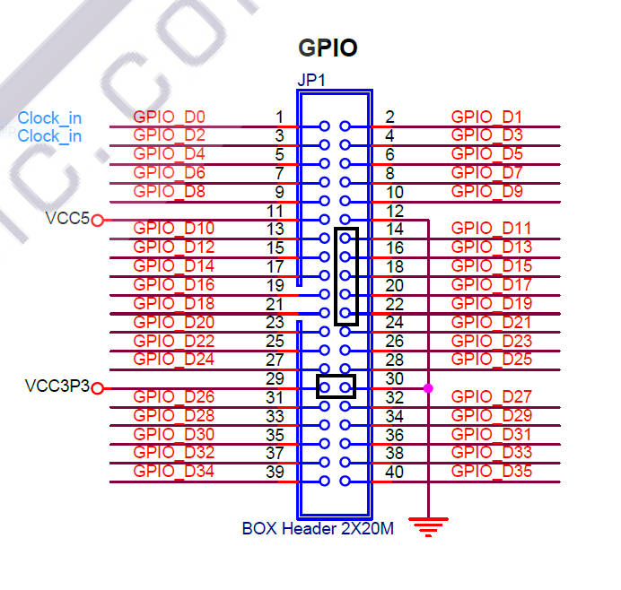
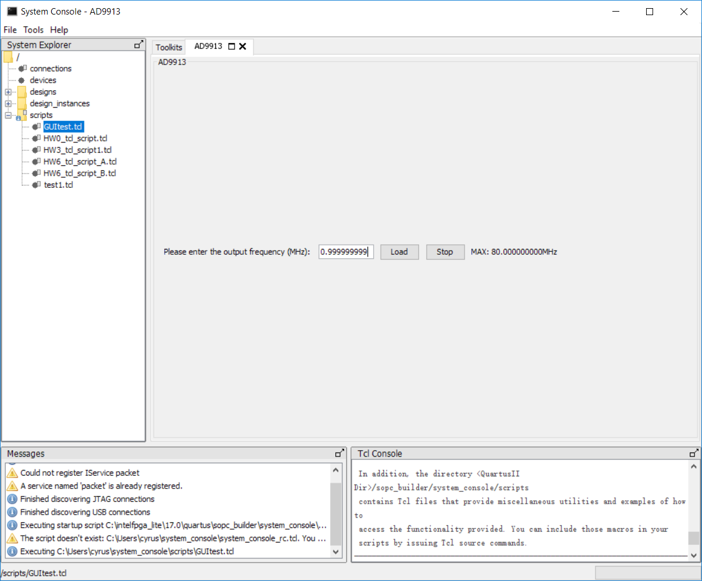

# System setup with DE10-Standard
## Software/Hardware needed
* DE10-Standard
* Quartus Prime (tested on ver.17.0)
* The AD9913 Board
* At least 8 female-female cables
## Setup Procedures
1. Download the project folder `DE10_Standard_AD9913`. Open up `DE10_Standard_AD9913.qpf` using Quartus Prime.
2. Compile the design to ensure code integrity. (Only needed for the first time)
3. Connect DE10-Standard to the host PC USB port using type A to B USB cable, and connect the power cord.
4. Connect designated GPIO pins on DE10 to the pins on the AD9913 board using female-female wires. . 
The GPIO pinout is shown as below and used pins are marked.  
  
The connections to AD9913 board:  

| GPIO Pins | AD9913 Board |
|-----------|--------------|
| GPIO_D11  | IOUPDATE     |
| GPIO_D13  | CS_N         |
| GPIO_D15  | SDIO         |
| GPIO_D17  | SCLK         |
| GPIO_D19  | RESET        |
| VCC3P3    | 3V3          |
| GND       | GND          |
5. Power up DE10.
6. Open "Program Device (Open Programmer)" window from Quartus. 
If the proper driver has been installed, DE10 should appear connected. 
Click "Start" to program the device.
7. After programming goes to 100%, from Quartus top menu, open Tools-System Debugging Tools-System Console. 
Right click on "scripts" folder on the right side, select "Open User Scripts Folder". 
Copy `GUITest.tcl` from `DE10_Standard_AD9913/command_scripts` into the opened `scripts` folder.
8. `GUITest.tcl` contains a simple GUI for control AD9913 output frequency according to user input. 
To use it, double click `GUITest.tcl` under scripts folder in System Console. 
The interface is shown as below. 
The user input frequency ranges from 0 to 80, with up to 7 digits of precision. 
Press "Load" to generate clock output at input frequency. Press "Stop" to terminate frequency output.
   

## Known Issues and Workarounds
1. Sometimes when the AD9913 board is boot up for the first time, executing the test program would not generate frequency output. 
When this situation happens, try to only connect 3V3, GND and RESET pins, and press "Load" on the test program to generate a RESET signal for the AD9913 chip.

 
